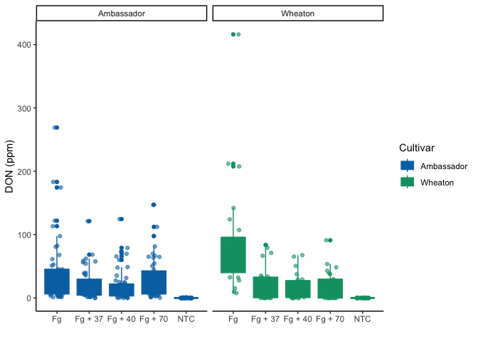
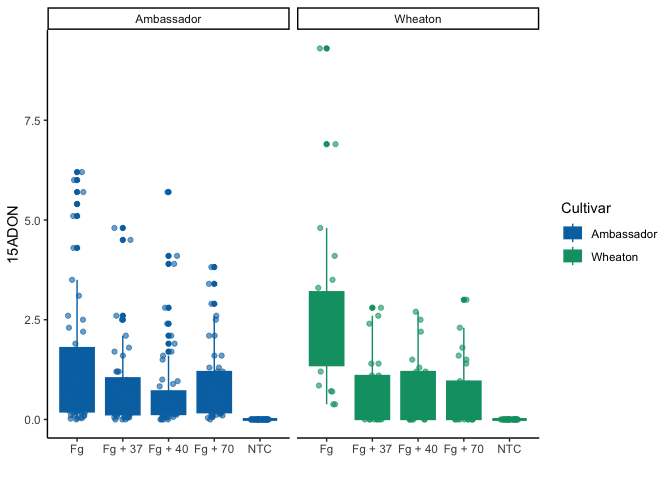
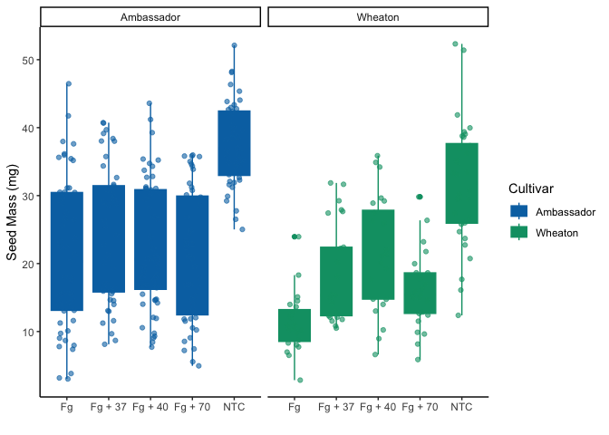
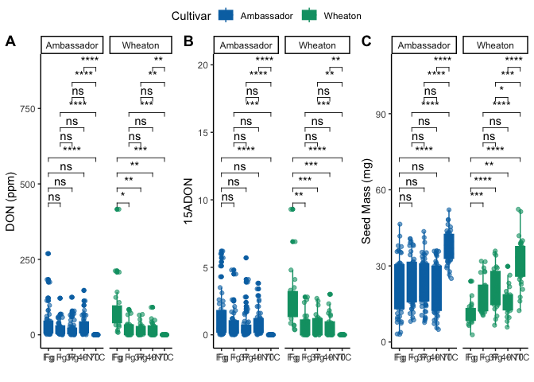

-   [0.1 Question 1: Explain the
    following](#question-1-explain-the-following)
-   [0.2 Question 2: Take the code you wrote for coding challenge 3,
    question 5, and incorporate it into your R markdown file. Some of
    you have already been doing this, which is great! Your final R
    markdown file should have the following
    elements.](#question-2-take-the-code-you-wrote-for-coding-challenge-3-question-5-and-incorporate-it-into-your-r-markdown-file.-some-of-you-have-already-been-doing-this-which-is-great-your-final-r-markdown-file-should-have-the-following-elements.)
    -   [0.2.1 At the top of the document, make a clickable link to the
        manuscript where these data are
        published.](#at-the-top-of-the-document-make-a-clickable-link-to-the-manuscript-where-these-data-are-published.)
    -   [0.2.2 Read the data using a relative file path with na.strings
        option set to “na”. This means you need to put the Mycotoxin.csv
        file we have used for the past two weeks into your directory,
        which git
        tracks.](#read-the-data-using-a-relative-file-path-with-na.strings-option-set-to-na.-this-means-you-need-to-put-the-mycotoxin.csv-file-we-have-used-for-the-past-two-weeks-into-your-directory-which-git-tracks.)
    -   [0.2.3 Make a separate code chunk for the figures plotting the
        DON data, 15ADON, and Seedmass, and one for the three combined
        using
        ggarrange.](#make-a-separate-code-chunk-for-the-figures-plotting-the-don-data-15adon-and-seedmass-and-one-for-the-three-combined-using-ggarrange.)
-   [0.3 Question 3: Knit your document together in the following
    formats:](#question-3-knit-your-document-together-in-the-following-formats)

## 0.1 Question 1: Explain the following

1.  YAML header: there is general information about date, authors and
    the type of output desire to obtain after the knit.
2.  Literate programming: is when a computer programme is giving as an
    explanation of how it works.

## 0.2 Question 2: Take the code you wrote for coding challenge 3, question 5, and incorporate it into your R markdown file. Some of you have already been doing this, which is great! Your final R markdown file should have the following elements.

### 0.2.1 At the top of the document, make a clickable link to the manuscript where these data are published.

[link to the manuscript](https://doi.org/10.1094/PDIS-06-21-1253-RE)

### 0.2.2 Read the data using a relative file path with na.strings option set to “na”. This means you need to put the Mycotoxin.csv file we have used for the past two weeks into your directory, which git tracks.

    data <- read.csv("~/Library/CloudStorage/OneDrive-AuburnUniversity/Spring 2025/PLPA_5820/Markdown_notes/MycotoxinData.csv", na.strings = "na")

### 0.2.3 Make a separate code chunk for the figures plotting the DON data, 15ADON, and Seedmass, and one for the three combined using ggarrange.

    #install.packages("ggplot2")
    library(ggplot2)

    # Preparing the color blind palette that we are going to use. If we define color within a vector, then we can just reference the colors later in the figures
    cbbPalette <- c("#000000", "#E69F00", "#56B4E9", "#009E73", "#F0E442", "#0072B2", "#D55E00", "#CC79A7")

    # Plot DON data
    question1 <- ggplot(data, aes(x = Treatment, y = DON, color = Cultivar, fill = Cultivar)) +
           geom_boxplot(position = position_dodge()) +
      geom_point(position = position_jitterdodge(dodge.width = 0.9), alpha = 0.6, ) +
      facet_wrap(~Cultivar, scales = "fixed") +
      xlab("") +
      ylab("DON (ppm)") +
      scale_fill_manual(values = c(cbbPalette[[6]], cbbPalette[[4]])) +
      scale_color_manual(values = c(cbbPalette[[6]], cbbPalette[[4]])) +
      theme_classic()

    question1

    ## Warning: Removed 8 rows containing non-finite outside the scale range
    ## (`stat_boxplot()`).

    ## Warning: Removed 8 rows containing missing values or values outside the scale range
    ## (`geom_point()`).

    # Plot 15ADON data
    question3_plot1 <- ggplot(data, aes(x = Treatment, y = X15ADON, color = Cultivar, fill = Cultivar)) +
      geom_boxplot(position = position_dodge()) +
      geom_point(position = position_jitterdodge(dodge.width = 0.9), alpha = 0.6, ) +
      facet_wrap(~Cultivar, scales = "fixed") +
      xlab("") +
      ylab("15ADON") +
      scale_fill_manual(values = c(cbbPalette[[6]], cbbPalette[[4]])) +
      scale_color_manual(values = c(cbbPalette[[6]], cbbPalette[[4]])) +
      theme_classic()

    question3_plot1

    ## Warning: Removed 10 rows containing non-finite outside the scale range
    ## (`stat_boxplot()`).

    ## Warning: Removed 10 rows containing missing values or values outside the scale range
    ## (`geom_point()`).

    # Plot Seedmass data
    question3_plot2 <- ggplot(data, aes(x = Treatment, y = MassperSeed_mg, color = Cultivar, fill = Cultivar)) +
      geom_boxplot(position = position_dodge()) +
      geom_point(position = position_jitterdodge(dodge.width = 0.9), alpha = 0.6, ) +
      facet_wrap(~Cultivar, scales = "fixed") +
      xlab("") +
      ylab("Seed Mass (mg)") +
      scale_fill_manual(values = c(cbbPalette[[6]], cbbPalette[[4]])) +
      scale_color_manual(values = c(cbbPalette[[6]], cbbPalette[[4]])) +
      theme_classic()

    question3_plot2

    ## Warning: Removed 2 rows containing non-finite outside the scale range
    ## (`stat_boxplot()`).

    ## Warning: Removed 2 rows containing missing values or values outside the scale range
    ## (`geom_point()`).

    #Loading library
    library(ggpubr)
    question5_plot1 <- question1 +
      geom_pwc(aes(group = Treatment), method = "t_test", label = "p.adj.signif")

    question5_plot2 <- question3_plot1 +
      geom_pwc(aes(group = Treatment), method = "t_test", label = "p.adj.signif")

    question5_plot3 <- question3_plot2 +
      geom_pwc(aes(group = Treatment), method = "t_test", label = "p.adj.signif")

    question5_plot4 <- ggarrange(question5_plot1, 
                                 question5_plot2, 
                                 question5_plot3, 
                           labels = c("A", "B", "C"),
                           nrow = 1,  
                           ncol = 3,
                           common.legend = T)

    ## Warning: Removed 8 rows containing non-finite outside the scale range
    ## (`stat_boxplot()`).

    ## Warning: Removed 8 rows containing non-finite outside the scale range
    ## (`stat_pwc()`).

    ## Warning: Removed 8 rows containing missing values or values outside the scale range
    ## (`geom_point()`).

    ## Warning: Removed 8 rows containing non-finite outside the scale range
    ## (`stat_boxplot()`).

    ## Warning: Removed 8 rows containing non-finite outside the scale range
    ## (`stat_pwc()`).

    ## Warning: Removed 8 rows containing missing values or values outside the scale range
    ## (`geom_point()`).

    ## Warning: Removed 10 rows containing non-finite outside the scale range
    ## (`stat_boxplot()`).

    ## Warning: Removed 10 rows containing non-finite outside the scale range
    ## (`stat_pwc()`).

    ## Warning: Removed 10 rows containing missing values or values outside the scale range
    ## (`geom_point()`).

    ## Warning: Removed 2 rows containing non-finite outside the scale range
    ## (`stat_boxplot()`).

    ## Warning: Removed 2 rows containing non-finite outside the scale range
    ## (`stat_pwc()`).

    ## Warning: Removed 2 rows containing missing values or values outside the scale range
    ## (`geom_point()`).

    question5_plot4

## 0.3 Question 3: Knit your document together in the following formats:
